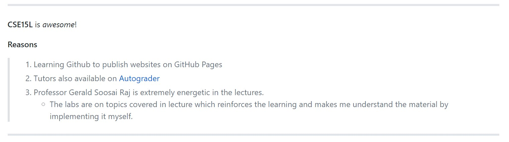

# File 2 Header
## Subheader: This is another file
## Smaller header: Markdown syntaxes file

Hello, this is another file that is created for lab 2.
This is **Bold** text.
This is *italicized*. 

___

**CSE15L** is _awesome_!

__Reasons__
> 1. Learning Github to publish websites on GitHub Pages
> 2. Tutors also available on [Autograder](https://autograder.ucsd.edu)
> 3. Professor Gerald Soosai Raj is extremely energetic in the lectures.
> * The labs are on topics covered in lecture which reinforces the learning and makes me understand the material by implementing it myself.

___
**Code**

Inline:

`System.out.println(Hello!);`

Code block:

```
//Simple code printing two lines
System.out.println("Hello CSE 15L!");
System.out.println("Have a great day!");

```

__
CSE Building/Warren Bear:


___
Screenshot:


[Lab Report 1](lab-report-1-week-2.html)


[Lab Report 1](https://khushijpatel.github.io/cse15l-lab-reports/file2.html)