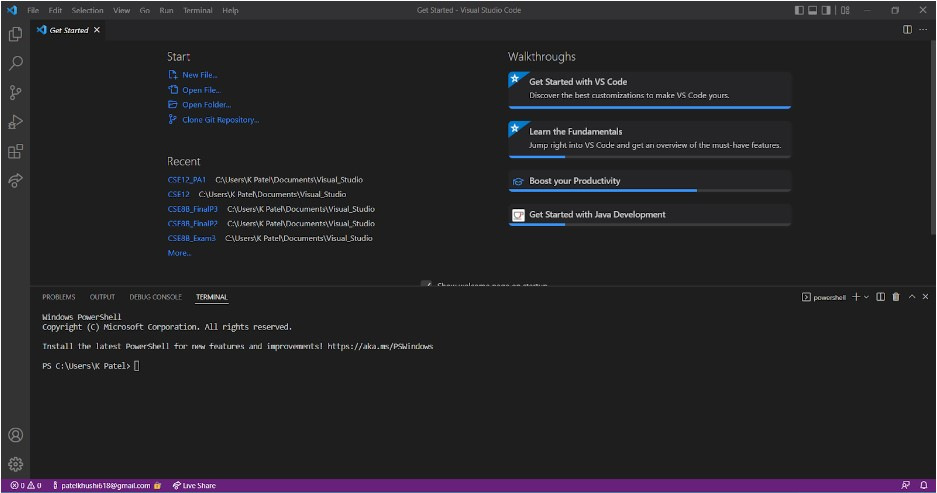
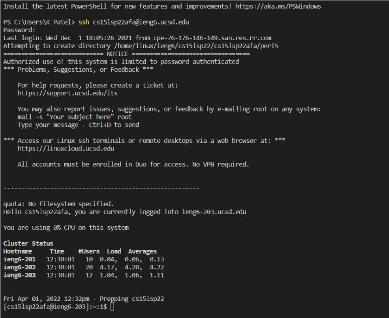
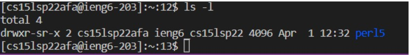
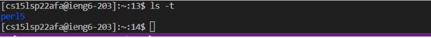
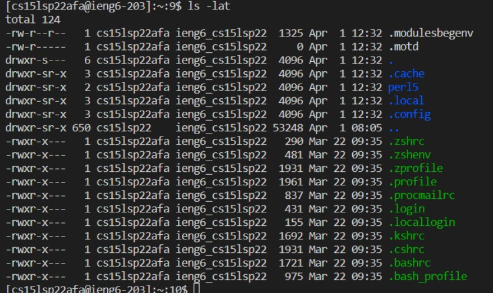
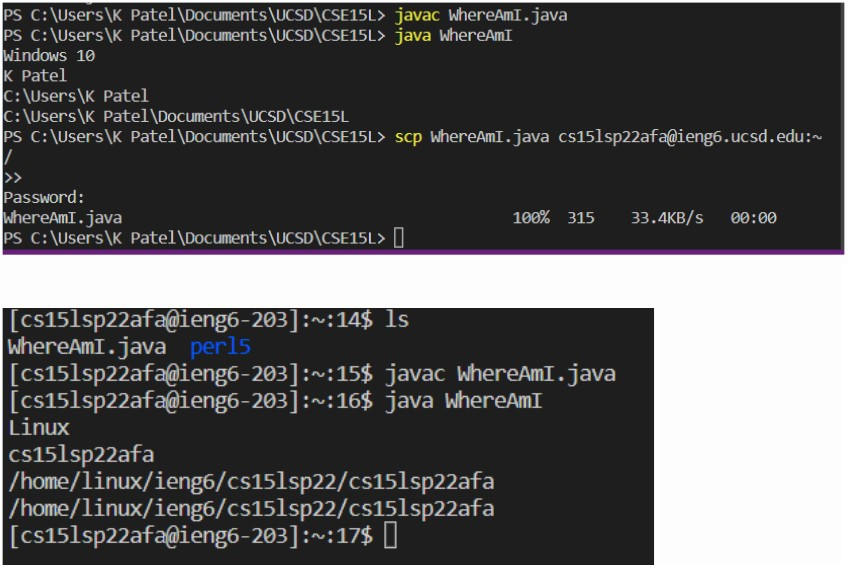
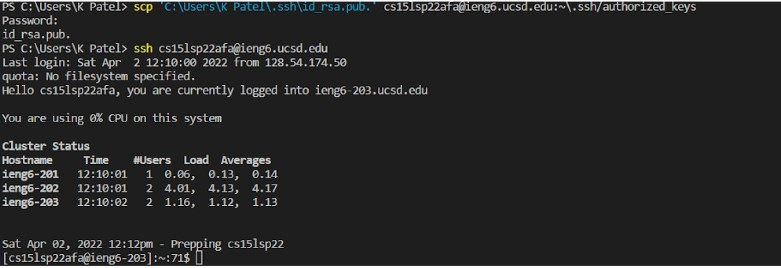
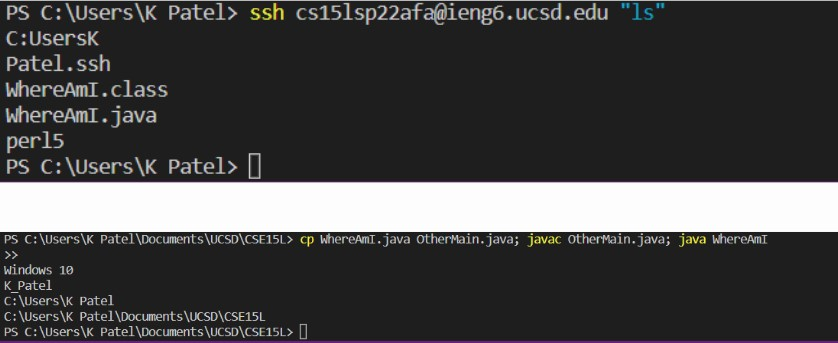

# CSE 15L Lab Report 1: Week 2

--- 

#### Link to the writeup is [here](https://www.google.com/url?q=https://docs.google.com/document/d/1AO6RDoJnaWxMui-UFjEa_2bbQ4qcANpbIpPuV-awsOg/edit?usp%3Dsharing&sa=D&source=editors&ust=1649484484366368&usg=AOvVaw1NjKpJKVuFNvtFC8ZlyWdc). The steps and work is done by following the lab 1 writeup from week 1.

---

## Installing VS Code
> * Image of VS Code:

> * Description:
I had VS Code downloaded previously so the only image is of the home screen of VS Code. You can download VS Code at this [link](https://code.visualstudio.com/download). Download and choose the basic settings. Open Visual Studio Code and the home page will have starting points and other options to choose from as seen in the image.

---

## Remotely Connecting
> * Image of Connecting Remotely:

> * Description:
Open the terminal, and login in remotely by typing *ssh username@ieng6.ucsd.edu* in the terminal. Enter the password to login and connect remotely. Password is not visible so no need to worry. Once you are successfully loged in, you will see a hello messay and the amount of CPU being used and cluster status. 

---

## Trying Some Commands
> * Image of ls -l command:

> * Description:
Open the terminal and type in *ls -l* when connected in the remote server. It will print the files in a long list format but since there were not many files when running the command (image), we see the total 4. 

> * Image of ls -t command:

> * Description:
Open the terminal and type in *ls -t* when connected in the remote server. ls -t sorts by modification time, newest first (based on description from typing ls - -help).

> * Image of ls -lat command:

> * Description:
Open the terminal and type in *ls -lat* when connected in the remote server. lat is the combination of ls -l, ls -a, and ls -t. ls -l and ls -t are shown above. ls -a lists all the files, where a stands for all.

---
## Moving Files with scp
> * Image:

> * Description:
Open the terminal. Create a file on your computer called WhereAmI.java. Run it using javac and java on your computer. Run the command: scp WhereAmI.java username@ieng6.ucsd.edu:~/ Then, log in with ssh and run the file on the ieng6 computer using javac and java.

---

## Setting an SSH Key
> * Image:

> * Description:
Open the terminal and type *ssh-keygen*. It creates the public key and private key. Copy the public key somewhere on the server, and the private key somewhere on the client. Then, the ssh command won't ask for a password when logging in from the client/local computer (that this key was generated on).
> > * Link to [writeup](https://docs.google.com/document/d/1AO6RDoJnaWxMui-UFjEa_2bbQ4qcANpbIpPuV-awsOg/edit) for detailed steps needed to take for implementing the public key.

---

## Optimizing Remote Running
> * Image:

> * Description:
Nice process for making a local edit to WhereAmI.java, then copying it to the remote server and running it.
The command `$ ssh cs15lsp22zz@ieng6.ucsd.edu "ls"` will log in and list the home directory on the remote server. Semicolons will run multiple commands on the same line in most terminals: 
`$ cp WhereAmI.java OtherMain.java; javac OtherMain.java; java WhereAmI`

