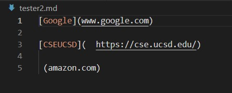

# Lab Report 2
Code and some tests worked on in group.
Original forked from [here](https://github.com/nidhidhamnani/markdown-parser).

## Code Change 1

**Code Diff**

**Failure Inducing Input**

[Test file](https://github.com/khushijpatel/markdown-parser/blob/main/tester2.md)

**Symptom**

The symptom shows an out of memory error.

**Description**

Due to the extra spaces and text that was not properly formmatted into a link in the test file, there was an out of memory error. The failure-inducing input is the test file, the symptom is OutOfMemoryError, and the bug is the code in MarkdownParse.java did not account for extra spaces. The test file is inputted to go through the markdown parser but the bug of not having a check for extra line causes the symptom of an out of memory error.

## Code Change 2
**Code Diff**

**Failure Inducing Input**

[Test file](https://github.com/khushijpatel/markdown-parser/blob/main/tester.md?plain=1)

**Symptom**

Before:

After:

**Description**
The link of image was showing up in the returned list, when it should not show up in the list. To fix this, code was edited to check for the excalmation mark(!) in the file. After the change, the link does not show up in the list. The failure input was the file containing an image link inputted into the bugged code which did not contain a check for an image link (there's an exclamation mark at before opening bracket). This bug resulted in symptom of wrong output. 

## Code Change 3
**Code Diff**

**Failure Inducing Input**
[Test file](https://github.com/khushijpatel/markdown-parser/blob/main/tester3.md)

**Symptom**

**Description**
In the links returned in the terminal, there are a couple of links repeated consecutively when it should not be. In order to fix the repeatedness, we edited the code to make sure there are are no unnecessary repeats. The bug in the code caused the symptom of wrong output when the failure inducing input (test file) was run.

## MarkdownParse

MarkdownParse files found [here](https://github.com/khushijpatel/markdown-parser).