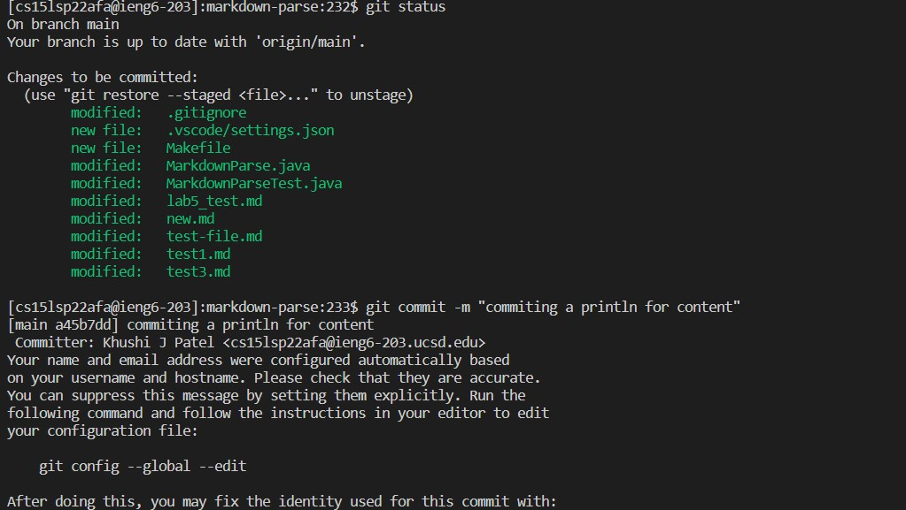
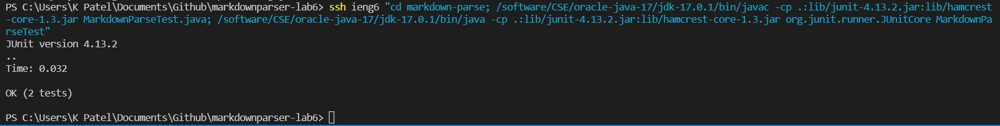

# Lab Report 3

## Streamlining ssh Configuration
Show your .ssh/config file, and how you edited it (with VScode, another program, etc)

Show the ssh command logging you into your account using just the alias you chose.

Show an scp command copying a file to your account using just the alias you chose.

## Setup Github Access from ieng6
Show where the public key you made is stored on Github and in your user account (screenshot).

Show where the private key you made is stored on your user account (but not its contents) as a screenshot.

Show running git commands to commit and push a change to Github while logged into your ieng6 account.

Show a link for the resulting commit.

## Copy whole directories with scp -r
Show copying your whole markdown-parse directory to your ieng6 account.

Show logging into your ieng6 account after doing this and compiling and running the tests for your repository.

Show (like in the last step of the first lab) combining scp, ;, and ssh to copy the whole directory and run the tests in one line.

