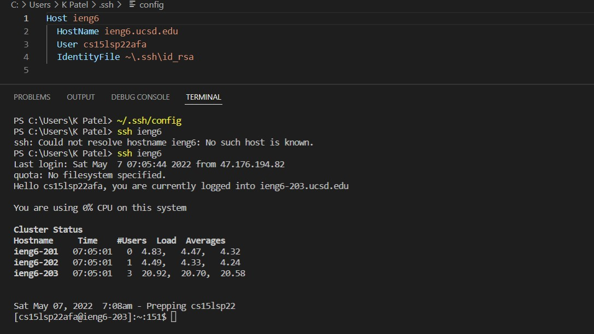

# Lab Report 3

## Streamlining ssh Configuration
Show your .ssh/config file, and how you edited it (with VScode, another program, etc)

The ssh command logging into my account and the config file on VSCode are shown. Typing `~/.ssh/config` tells SSH what username to use when logging into specific servers in this case ieng6.

An scp command copying a file, GradingTests from lab 6, to my account.

## Setup Github Access from ieng6
The public key is stored on Github. To access the location click on profile -> Settings. Then on the left side there's an option for SSH, click that. 

The private key is stored under the name of ` id_rsa.pub ` in the ` ~/.ssh ` folder.

Running git commands to commit and push a change in mardownparse to Github while logged into my ieng6 account.

The link for the resulting commit is
[here](https://github.com/khushijpatel/markdownparser-lab6/commit/f0b90cd1f23c96d17a236b54491e7b96e4dc0366)

## Copy whole directories with scp -r
Copying the whole markdown-parse directory to my ieng6 account.

Logging into my ieng6 account after doing scp and compiling and running the tests.

Combining scp, ;, and ssh to copy the whole directory and run the tests in one line.

