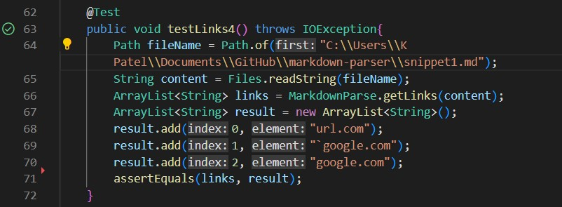
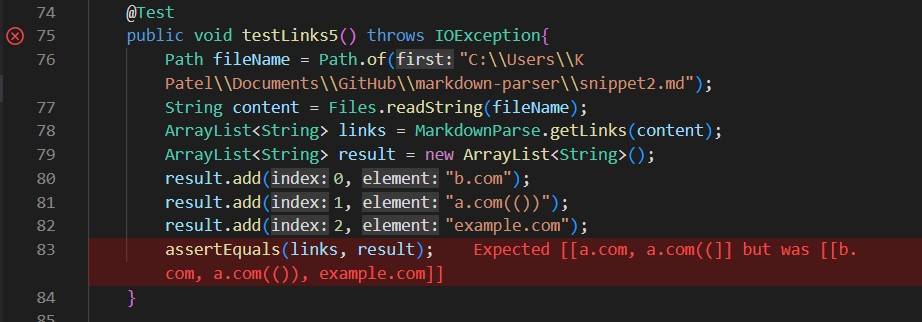
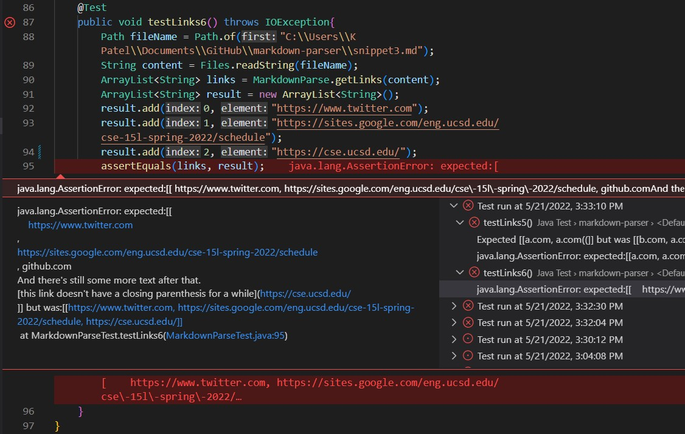
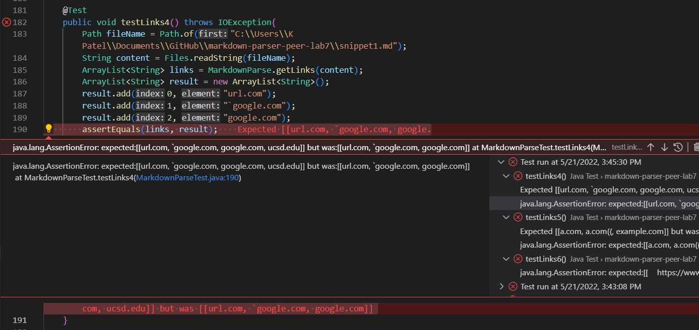
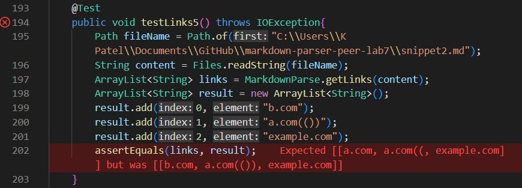
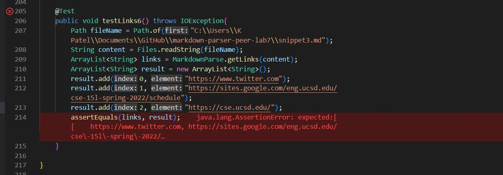

# Lab Report 4 Week 8

### Markdown-parse repository links:

[Link of Peer Reviewed](https://github.com/brandoluu/markdown-parser)

[Link to own](https://github.com/khushijpatel/markdown-parser)

### Expected Results: 
Snippet 1 should produce: [url.com, `google.com, google.com]

Snippet 2 should produce: [b.com, a.com(()), example.com]

Snippet 3 should produce: [https://www.twitter.com, https://sites.google.com/eng.ucsd.edu/cse-15l-spring-2022/schedule, https://cse.ucsd.edu/]

### Testing with Junit on own Markdown Parse:
Snippet1 test on own markdown parser:

Snippet2 test on own markdown parser:

Snippet3 test on own markdown parser:

### Testing with Junit on Peer Markdown Parse reviewed in week 7:
Snippet1 test on markdown parser reviewed in week 7:

Snippet2 test on markdown parser reviewed in week 7:

Snippet3 test on markdown parser reviewed in week 7:

### Reflecting on Code. Will small code change make each snippet pass?
While the test case for snippet 1 passed for my markdown-parser, there are some changes that can be made. I can specifically include a situation for handling inline code with backticks so it can be ensured links with backticks can be included.

There might not possibly be a small code change to make my program work for snippet 2. I would have to create a case that handles nested parentheses or brackets. If there are nested parantheses or brackets, then the link itself should be with the nested parentheses or brackets. Another case I need is to include is for escaped brackets. If there is an escaped bracket, it should forget the text until the next line with the link. Having to take care of these two different cases might take more than 10 lines. 

There can be a small code change that will make the program work for snippet 3. To take care of this case with newlines in brackets and parentheses, I have to consider this case. If there are newlines in brackets and parentheses then it should skip over these lines and find the next valid line of link. 

### Explanation why snippet cast passed
Test case for snippet 1 worked my markdown parser. The reason it passes is because the code checks for a set of open and close bracket then gets the content in the parentheses. The backticks do not affect it because this program essentially searches for the open and closing brackets and parentheses. 