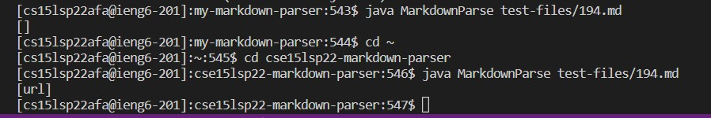
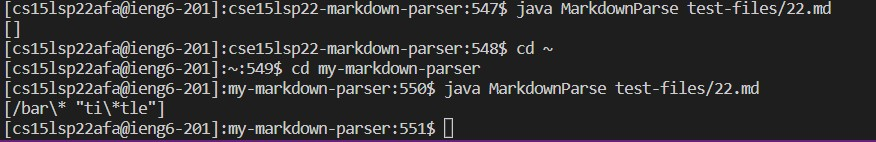
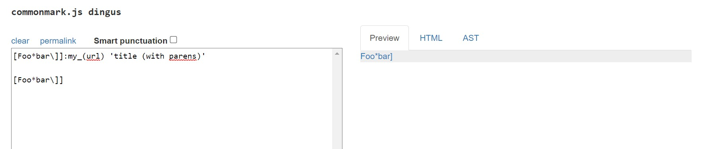
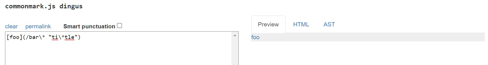
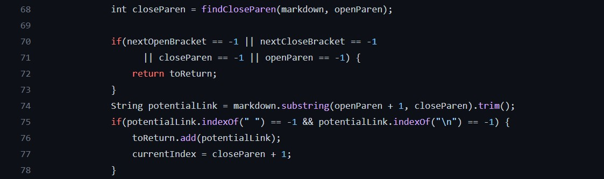
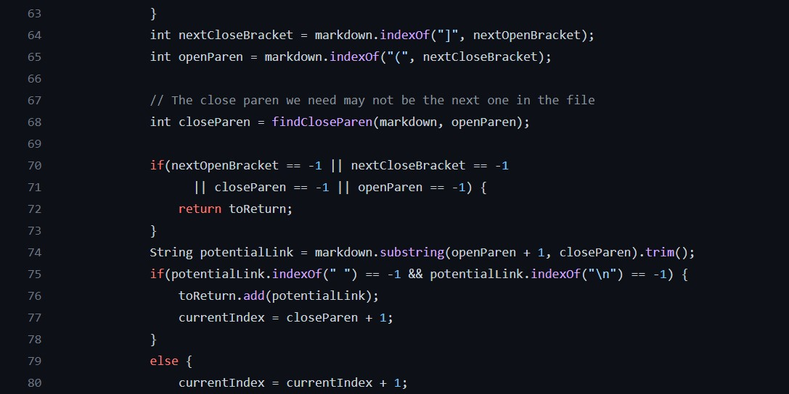

# Lab Report 5

### Finding The Tests With Different Results

I found the tests with different results manually. I choose a couple randon numbers to run the tests on and found two tests that had different results in my implementation (my-markdown-parser) and the one provided (cse15lsp22-markdown-parser). Test one that differed was test number 194.md and the second test that differed was test number 22.md. 

Link to the test-file with different-results:

[Test 1- 194.md](https://github.com/nidhidhamnani/markdown-parser/blob/main/test-files/194.md)

[Test 2- 22.md](https://github.com/nidhidhamnani/markdown-parser/blob/main/test-files/22.md)

### Which Implementation is Wrong?

The implementation provided (cse15lsp22-markdown-parser) for test 194.md is incorrect because it results in [url] when it should be [myurl]. My implementation is also incorrect because it resulted in an empty list []. 

The implementation provided (cse15lsp22-markdown-parser) is incorrect because it does not ouptut anything. The result of running test 22.md on the provided implementation is [] a blank array. On the other hand, my implementation passed since it returned [/bar\* "ti\tle"] which should have been resulted since it is a link.

### What Should It Produce 
Test 22 should produce the following: [/bar\* "ti\tle"]

Test 194 should produce the following: [my_(url)]

### Bug Description

For test 22.md the bug is likely in line 75. The if statement only runs if the index of the quotes is -1. In this test the link has quotes inside so the potential issue is looking at the inner quotes are the text of the link instead of the considering the quotes to be part of the link. 

For test 194.md the bug is likely in line 70. This test case has two different sets of parantheses and the result is supposed to be my_(url). The if statement in the implementation provided does not seem to account for this case with multiple sets of parentheses (two open and closed parantheses). The implmentation only adds the text inside the first parantheses which is url. The expected result is supposed to be [my_(url)] so the parantheses are not included in the link.